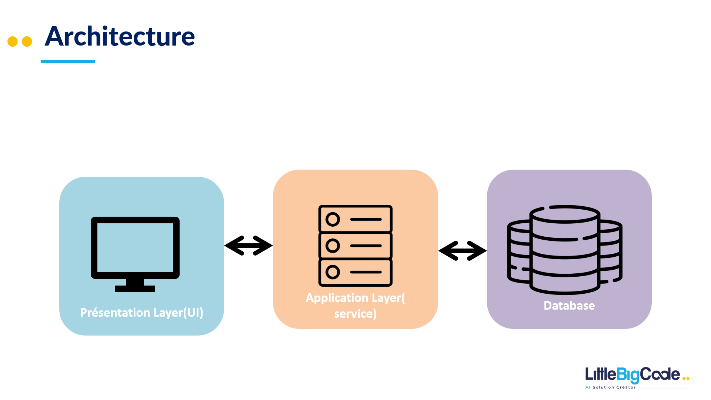

# User-management-LBC

This project implements a REST API for user management using Spring Boot and the reactive paradigm. It connects to a SQL or NoSQL database and exposes endpoints to list all users and retrieve users by their unique identifiers.

## Features

- List all users: `GET /api/user/list`
- Get user by ID: `GET /api/user/{id}`
- Create user:  `POST /api/user  {UserDTO}`
- Delete user: `DELETE /api/user/{id}`
## Architecture
### 3-tier Architecture

The three-tier architecture is a modular client-server setup comprising presentation, application, and data tiers. It enhances horizontal scalability, performance, and availability by separating responsibilities among tiers, allowing independent development by different teams using varied programming languages.


## Disadvantages:
### Limited Agility: 
When working with a three-layer architecture, each layer plays a vital role in the overall functioning of the application. Let's say we want to make a specific change in the way data is processed and displayed. This modification may require adjustments in each of the layers.The interdependence between the different layers of the architecture creates challenges when making changes. Each change can impact multiple parts of the application, slowing down the ability to quickly adjust the system. This means that with each change, you have to take the time to check and adapt several elements of the application, which slows down the process.
### Lack of security:
Data security can be compromised if encryption measures are not applied uniformly to all parts of the application. For example, if passwords are not properly encrypted in the database or during transmission between layers of the application, sensitive information is exposed. This could allow unauthorized access or result in data breaches.

Additionally, when security measures are not strong enough, it can expose sensitive data. If the application does not implement adequate access controls or effective data encryption, this poses a significant risk to data confidentiality and integrity.
### No test:
A lack of a comprehensive testing strategy can make the application less robust. Implementing a test-oriented development approach or regular testing processes helps to spot and fix errors quickly, ensuring a more stable and reliable application.

Additionally, without proper testing, users might encounter unexpected errors or glitches in the application. This could harm their experience and make them dissatisfied, thus impacting the adoption and usability of the management application.
# Deployment Instructions

## Prerequisites

- Java Development Kit (JDK) 17 or later installed
- MySQL database instance available

## Steps to Deploy

1. **Clone the Repository:**
   ```bash
   git clone https://github.com/yourusername/LBC_Back.git
2. **Database Configuration:**
-Ensure a MySQL database is available.
-Update the application.properties file  with database configuration:
 ```bash
spring.flyway.enabled=true
spring.flyway.url=jdbc:mysql://127.0.0.1:3306/user_db?useLegacyDatetimeCode=false&serverTimezone=Europe/Paris

spring.flyway.user=root
spring.flyway.password=Root123456
logging.level.org.springframework.flyway=DEBUG
spring.r2dbc.url=r2dbc:mysql://localhost:3306/user_db?useLegacyDatetimeCode=false&serverTimezone=Europe/Paris


spring.r2dbc.username=root
spring.r2dbc.password=Root123456
logging.level.io.r2dbc=DEBUG
````
3. **Build the Project:**
```bash
mvn clean package
````
4. **Run the Application:**

```bash
java -jar target/LBC_Back-0.0.1-SNAPSHOT.jar
````

5. **Access the Application:**
Once the application is running, access the API endpoints at http://localhost:8080/api/users


### Production
unfortunately I have never done docker, I am stuck at this step, I have added my various tests to you

### how you can improve it, using an other technology or an other pattern
Domain-Driven Design (DDD) diverges from the traditional three-tier architecture by prioritizing a deep understanding of the business domain. Unlike the layer-based structure of the three-tier model, DDD centers on a holistic and business-centric approach. By embracing DDD, teams gain a clearer insight into the complex business domain and foster a unified language shared by both technical and non-technical stakeholders. This approach promotes enhanced communication and a more accurate reflection of the business domain within the software. DDD's focus on bounded contexts enables better organization and delineation of distinct domains, reducing complexity and allowing independent development. Through defining aggregates, entities, and domain-driven patterns, DDD cultivates a cohesive, maintainable codebase that harmonizes with the intricacies of the business domain.

## Advantages and disadvantages of using the reactive programming paradigm
### Advantages
On the positive side, this approach allows for better scalability due to its use of asynchronous operations, thus providing efficient management of a large number of concurrent users. Additionally, it can improve system responsiveness, being particularly useful for applications requiring real-time responses.
### Disavantages 
However, this method may require additional learning for developers accustomed to more conventional methods, and the inherent complexity of asynchronous programming can make code maintenance more arduous. Managing the constant flow of data can also pose challenges, as can the fact that some reactive tools and frameworks may not be as mature or comprehensive as their traditional counterparts. In summary, although reactive programming can offer significant benefits, it can also introduce complexities that require careful evaluation before adoption.
